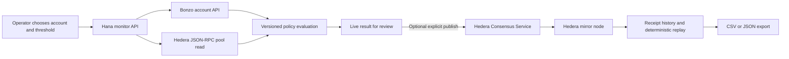

# Hana

**A read-only Bonzo Lend monitor with replayable Hedera receipts.** Hana checks a borrower’s reported health factor and the lending pool’s pause state, compares the result with a rule you choose, and lets you publish that rule and reviewed observations to Hedera Consensus Service (HCS).

Hana is an informational monitor. It cannot borrow, repay, approve tokens, liquidate a position, or sign with a user wallet. A receipt records what its publisher submitted; it does not independently prove the source data was correct or that every check ran.

## What Hana does

- Reads account health and debt from Bonzo’s account API and reads the pool pause flag from Hedera JSON-RPC.
- Evaluates the source values against a versioned health-factor threshold. Missing, stale, malformed, or unsupported data stays `unknown`.
- Publishes a policy and, when you choose, an observation to a configured Hedera testnet topic using a server-side operator.
- Loads topic messages from a mirror node and replays observations against their matching policy.
- Runs optional position checks every 30 seconds, 1 minute, or 5 minutes while the browser tab is visible. Automatic checks only read source data; they never publish to HCS.
- Exports all currently loaded receipts and replay results as CSV or JSON. Exports flag when mirror-node history is truncated.

## Run locally

Requirements: Node.js 20.18.3 or later and npm.

```sh
npm install
cp packages/nextjs/.env.example packages/nextjs/.env.local
npm run next:dev
```

Open [http://localhost:3000](http://localhost:3000). Enter a Hedera account ID and an alert threshold, then select **Check position** to fetch live values. Publish a rule and record an observation only if you want those actions written to HCS. Monitoring and exports do not require signing credentials.

## Configuration

Set server-only values in `packages/nextjs/.env.local`:

| Variable                 | Purpose                                                                    | Default                                      |
| ------------------------ | -------------------------------------------------------------------------- | -------------------------------------------- |
| `BONZO_API_URL`          | Bonzo-compatible API base with `/info` and `/dashboard/{accountId}` routes | `https://mainnet-data-staging.bonzo.finance` |
| `HEDERA_RPC_URL`         | JSON-RPC endpoint used to read the pool pause state                        | Hashio mainnet endpoint                      |
| `HEDERA_MIRROR_NODE_URL` | Mirror-node API base used to read topic messages                           | Hedera testnet mirror node                   |
| `HEDERA_ACCOUNT_ID`      | Testnet operator account authorized to submit topic messages               | unset                                        |
| `HEDERA_PRIVATE_KEY`     | Server-only private key for the operator account                           | unset                                        |
| `HEDERA_TOPIC_ID`        | Existing testnet topic the operator can submit to                          | unset                                        |
| `HEDERA_PUBLISH_TOKEN`   | Shared passphrase required by the write route                              | unset                                        |

The `BONZO_API_URL` `/info` response supplies the source network and pool. Bonzo API data and Hedera RPC state come from separate services and may have different timestamps. Configure matching source and RPC environments for meaningful results. The HCS publisher is configured for Hedera testnet.

Never commit `.env.local` or expose `HEDERA_PRIVATE_KEY` or `HEDERA_PUBLISH_TOKEN` through a `NEXT_PUBLIC_` variable. The operator passphrase entered in the browser stays in that tab’s memory. Use a funded testnet operator and an existing topic whose submit-key policy allows that account. Before hosting the write route publicly, add deployment-level authentication, rate limits, and abuse controls.

The default Bonzo URL is a staging endpoint and may change. Set `BONZO_API_URL` and `HEDERA_RPC_URL` to current, compatible endpoints when needed. Hana does not replace protocol risk controls or guarantee that a position is safe.

## How a check flows



Automatic checks use the same read path and stop running when the tab is hidden. They never publish observations. Publishing a rule or recording a reviewed observation is a separate, explicit action.

## Decisions and receipts

The evaluator can return `healthy`, `watch`, `no-debt`, `paused`, or `unknown`. Pause takes precedence; zero debt is not presented as infinite safety. Missing, stale, or malformed source values fail closed to `unknown`.

HCS messages are compact versioned JSON and stay below Hedera’s 1,024-byte message limit:

- `borrower-checkpoint/policy-v1` stores the account, threshold, freshness window, creation time, and policy ID.
- `borrower-checkpoint/observation-v1` stores the matching policy ID, source network and pool, source timestamp, reported health factor and debt, pool pause state, observation time, and decision.

The `borrower-checkpoint` schema prefix is retained for receipt compatibility; the product is named **Hana**. History identifies unknown schemas and observations without a matching policy instead of treating them as verified. Replay recomputes supported observations against their matching policy. It cannot verify that the publisher’s source readings were truthful.

## Development

```sh
npm run next:check-types
npm run next:test
npm run next:lint
npm run next:build
npm run hardhat:compile
```

Workspace layout:

- `packages/nextjs` contains the Next.js App Router interface and API routes.
- `packages/hardhat` contains the Scaffold-HBAR Solidity development package. Hana reads Bonzo’s deployed pool and does not require deploying a custom contract.

## Scaffold-HBAR template

Hana includes the Scaffold-HBAR `template.json`, README, license, and agent notes. To use it with Scaffold-HBAR, select Next.js, Hardhat, and npm. After publishing the repository, run:

```sh
npx create-scaffold-hbar@latest --template kris70lesgo/Hana
```

See the [Scaffold-HBAR documentation](https://docs.hedera.com/solutions/tools/scaffold-hbar/index) for template setup.
